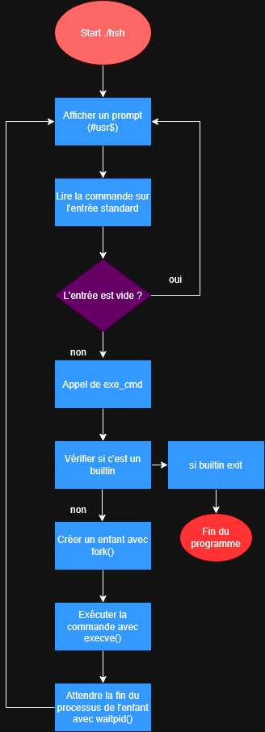

Presentation du Simple Shell créer par Lucas Podevin et Tommy Jouhans:

Créé par : Lucas Podevin et Tommy Jouhans

Description

L'objectif de ce projet est de créer un simple shell UNIX capable de lire des commandes depuis l’entrée standard ou depuis un fichier, et de les exécuter pour afficher le résultat sur la sortie standard.

Fonctionnalités

Exécution de commandes simples

Gestion de commandes avec arguments

Built-ins de base : exit, env

Lecture de commandes depuis un fichier (optionnel selon implémentation)

Compilation

Pour compiler le shell, utilisez la commande suivante :

gcc -Wall -Werror -Wextra -pedantic -std=gnu89 *.c -o hsh

Utilisation

Lancer le shell en mode interactif :

./hsh

Exécuter des commandes depuis un fichier :

./hsh filename

Flowchart

Auteurs

Lucas Podevin

Tommy Jouhans

